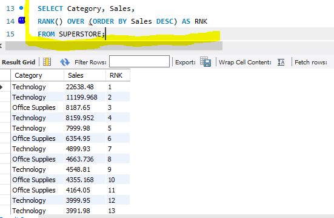

# ADVANCED SQL
## Introduction
Common Table Expressions (CTEs) are a powerful and userful feature in SQL for creating temporary result sets that can be referenced within a SELECT,INSERT,UPDATE or DELETE statement.CTEs make complex queries more readable and maintained by breaking them into smaller,logical parts.The following are CTEs functions
- ROW_NUMBER() assigns a unique integer to each row within the result set,starting from 1 for the first row and incrementing by 1 for each row
- RANK() assigns a unique rank to each row based on the specified criteria
- DENSE_RANK() is similar to RANK(), but it handles ties differently
# Problem Statement
The task requires that we replicate the exercise done during the class using different variables
## Result/Discussion
Using the superstore dataset,to see the Sales made by each category in "ROW_NUMBER()" in descending order,the function/syntax as seen in the snapshot below is used.
- 
- --

To see the Sales made by each category in "RANK()" in descending order,the function/syntax as seen in the snapshot below is used.
- 
- --

To see the Sales made by each category in "DENSE_RAN()" in descending order,the function/syntax as seen in the snapshot below is used.
- 
- --

- ## Conclusion
- Using the CTEs functions,it was possible to see the SALES by Categories in ROW_NUMBER(),RANK() and DENSE_RANK()
